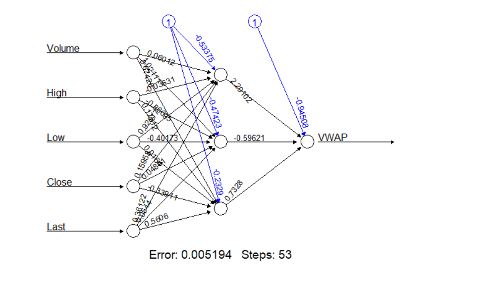
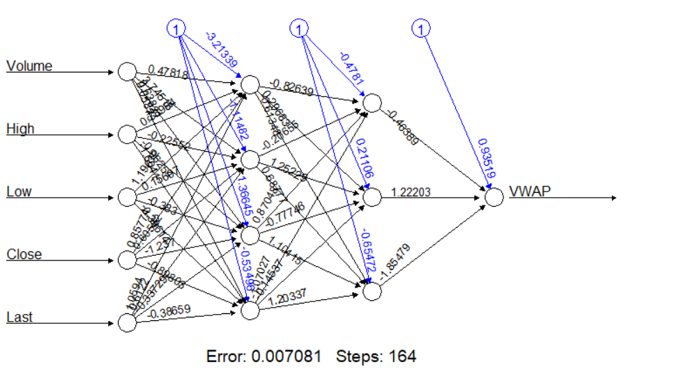

<style>
/* Your other css */
    body {
      background-image: url(https://wallpaperaccess.com/full/981549.jpg);
      background-position: center center;
      background-attachment: fixed;
      background-repeat: no-repeat;
      background-size: 100% 100%;
    }
.section .reveal .state-background {
    background-image: url(https://wallpaperaccess.com/full/981549.jpg);
    background-position: center center;
    background-attachment: fixed;
    background-repeat: no-repeat;
    background-size: 100% 100%;
}
</style>

<style>
div.blue pre.r { background-color:lightblue; }
</style>

<div class = "blue">
```{r setup, include=FALSE}
knitr::opts_chunk$set(echo = TRUE)
```

# YAPAY SINIR AGLARI

## NATIONAL STOCK EXCHANGE 

## KAYNAK: https://www.kaggle.com/atulanandjha/national-stock-exchange-time-series

```{r , echo=FALSE, message=FALSE, warning=FALSE}

```

```{r message=FALSE, warning=FALSE}
library(dplyr)
orjdata=read.csv("C:/Users/CASPER/Desktop/infy_stock.csv", header=T)
data=orjdata%>%select(c("VWAP","Volume","High","Low","Close","Last"))
head(data,10)
```

## VERI SETI ACIKLAMASI;

Ulusal Borsa:Hint bilisim sirketlerinin ulusal borsa veri setidir.
Hindistan Ulusal Borsasi (NSE) Mumbai, Maharashtra, Hindistan'da bulunan bir Hint borsasidir. Ulusal Menkul Kiymetler Borsasi (NSE) 1992 yilinda yetkisiz bir elektronik borsa olarak kuruldu. Hindistan Hukumeti'nin talebi uzerine onde gelen finans kuruluslari tarafindan tesvik edildi. Hindistan'in ciro ile yaptigi en buyuk borsa. 1994 yilinda elektronik ekran tabanli ticareti baslatti. Daha sonra, 2000 yilinda ulkede turunun ilk ornegi olan endeks futures ve internet ticareti baslatti. 248 gozlem 15 sutun bulunmakta.

## DEGISKENLER:

* Date: Verilerin kaydedildigi tarih.

* Symbol: Stokun NSE (Hindistan Ulusal Borsasi ) sembolu.

* Series: Bu hisse senedinin serisi.
(EQ,BE,BL,BT,GC,IL)

* Prev Close: Son gun kapanis noktasi.

* Open: Mevcut gun acilis noktasi.

* High: Mevcut gunun en yuksek noktasi.

* Low: Mevcut gunun en dusuk noktasi.

* Last: Son islem gununde belirli bir hisse senedi veya borsa endeksi icin son teklif edilen islem fiyati.

* Close: Gecerli gun icin kapanis noktasi.

* VWAP: Hacim agirlikli ortalama fiyat anlamina gelir, bir varligin belirli bir zaman araligi icin hacme gore agirligi alinmis ortalama fiyatidir.

* Volume: Belirli bir zaman diliminde islem goren menkul kiymet tutari. Her alici icin bir satici var ve her islem toplam hacim sayisina katkida bulunuyor.

* Turnover: Hisse senedinin o gune kadar toplam cirosu.

* Trades: Hisse senedi alim veya satim sayisi.

* Deliverable: Bir grup insandan (bugunden once demat hesabida bu hisseleri olan ve bugun satis yapan) baska bir grup insana (bu hisseleri satin almis olan ve bu hisseleri T+2 gunlerine kadar alacak olan) hareket eden hisse miktari. Demat hesabi(Hindistan Internet Borsasi)).

* %Deliverble: Bu hisse senedinin teslimat yuzdesi.

VWAP'yi ozellikle guclu bir gosterge haline getiren ortalama fiyat hesaplamasinda hacmi kullanma seklidir.
VWAP, hacmin gucuyle fiyat hareketini birlestirerek pratik ve kullanimi kolay bir gosterge yaratir. Alim satim yapanlar VWAP'yi bir trend onaylama ya da giris ve cikis noktalarini belirleme araci olarak kullanabilir.
VWAP her gunun basinda sifirlanir. Alim satim yapmak istedigimizde, VWAP'in altinda almak ve ustunde satmak karlidir. Fiyatin bugunku degerinin ustunde mi alim yaptik yoksa altinda mi alim yaptik bunu belirlememizi saglar.
Fiyat VWAP uzerinde ise, satmak icin iyi bir gun ici fiyattir. Fiyat VWAP'in altindaysa, satin almak icin iyi bir gun ici fiyatidir.

Verimde yer alan degiskenlerden "VWAP","Volume","High","Low","Close","Last" degiskenlerini kullanarak incelemeler yaptim.

#### Degiskenleri Aciklamada Kullanilan Ek Bilgi Kaynaklari:

https://www.investopedia.com/articles/trading/11/trading-with-vwap-mvwap.asp
https://www.binance.vision/tr/economics/volume-weighted-average-price-vwap-explained

Oncelikle verimizi ozetleyelim;

```{r message=FALSE, warning=FALSE}
summary(data)
```

Verimizin ozetine baktigimizda factor haline getirilecek degisken olmadigi gorulmektedir hatali bir durum yoktur.

Verimizde missing gozlemler var mi yok mu apply komutuyla kontrol etmeliyiz; 

```{r message=FALSE, warning=FALSE}
apply(data,2,function(x) sum(is.na(x)))#Her sutunda kac tane missing gozlem var bunu gorecegiz. Hepsi sifir ise problem yok.
```

Her sutunda kac tane missing gozlem var apply komutuyla goruluyor.
Verimizin sutunlarina baktigimizda eksik gozlem olmadigi gozukmektedir bu nedenle bir problem yoktur.

Verimizin yanit degiskeni surekli oldugu icin standartlastirma islemi uygulamamiz gerekmektedir.
Simdi sutunlarin maksimum ve minimum degerlerine bakalim;

```{r message=FALSE, warning=FALSE}
maxs <- apply(data, 2, max) #sutunlarin maksimum degerini verdi.
mins <- apply(data, 2, min) #sutunlarin minimum degerlerini verdi.
```

Center komutu ile verimizdeki tum gozlemlerden minimum degerini cikartip,
Scale komutu ile degerleri maksimum-minimum degerine bolerek verimizi standart hale getirelim;
Bu islem ile min-max normalization islemi yapiyoruz, bu islem verinin dagilimini ve yapisini bozmamaktadir.

```{r message=FALSE, warning=FALSE}
scaled <- as.data.frame(scale(data, center = mins, scale = maxs - mins))
head(scaled)
```

Simdi verimizi test ve train olarak ayiralim;
Verimizden %75 lik orneklem cekerek bunu train ve kalan %25 lik kismiyla test veri setimizi olusturalim.

```{r message=FALSE, warning=FALSE}
set.seed(100)

index <- sample(1:nrow(data),round(0.75*nrow(data)))
train_ <- scaled[index,] #%75 lik kismini train olarak ayirdik
test_ <- scaled[-index,]
```

Verimizi test ve train olarak ayirdiktan sonra Yapay Sinir Agi modeli kuralim ;

```{r message=FALSE, warning=FALSE}
library(neuralnet) #Yapay sinir agi kutuphanesi
set.seed(100)

n <- names(train_) #traindeki degiskenlerin isimlerini aliyor.
f <- as.formula(paste("VWAP ~", paste(n[!n %in% "VWAP"], collapse = " + ")))#bu komut kolay yoldan model kurmamizi saglar.
nn <- neuralnet(f,data=train_,hidden=3,linear.output=T) #Yapay sinir agi modeli
```

Burada hidden komutu degisken sayimizin 2/3 u olarak alinir, hidden=3 almamizin sebebi yaniti etkileyen degiskenlerimizin sayisi 5 olmasindan kaynaklidir.
Yanit dagiskenimiz surekli oldugundan linear.output degerini True alarak kullanmaliyiz.(Siniflandirma probleminde linear.output False alarak kullanilir.)

Simdi nn ile olusturdugumuz Yapay Sinig Agi modelini plot ile cizdirelim;

```{r message=FALSE, warning=FALSE}
plot(nn)
pr.nn <- compute(nn,test_[,2:6]) #VWAP (yanit degiskeni) disindaki degiskenleri modele sokuyor.
```

```{r  message=FALSE, warning=FALSE}

```

Yapay Sinir Agi icin cizdirdigimiz plota baktigimizda gizli katmaninda 3 tane noronun oldugu gozukmektedir. Error:0.005194 ve Stepst:53 cikmistir.

Bu degerler min-max normalization yapilmis haline gore hesaplanmistir.
Simdi yaptigimiz min-max normalization islemini geri dondurme islemini yapmaliyiz.

```{r message=FALSE, warning=FALSE}
set.seed(100)
pr.nn_ <- pr.nn$net.result*(max(data$VWAP)-min(data$VWAP))+min(data$VWAP) #Geri dondurme islemi yapiyoruz.Min-max ile carpip min ekledik.
pr.nn_ #Verimizin orjinal tahminleri.
```

Simdi kurdugumuz Yapay Sinir Agi modeli icin test veri seti uzerinden MSE degerini hesaplayalim;

```{r message=FALSE, warning=FALSE}
MSE.nn <- sum((data[-index,]$VWAP - pr.nn_)^2)/nrow(test_)
MSE.nn
```

Yapay Sinir Agi modelimiz icin Test veri seti uzerinden hesaplanan MSE degerimiz 106.2776 cikmistir.

Verimizdeki yanit degiskenimiz VWAP in test veri seti uzerinden Gercek Ve Tahmin NN lerinin plotunu cizdirelim;

```{r message=FALSE, warning=FALSE}
op = par(bg = "lavender")
plot(data[-index,]$VWAP,pr.nn_,col='orange',main='Real vs predicted NN',pch=19,cex=1)
abline(0,1,lwd=2)
```

Test verisinin gercek degerleri(x ekseni) ve ANN uzerinden tahmin edilen degerleri(y ekseni) uzerinde gozukmektedir.
Verimizdeki yanit degiskenimiz VWAP in test veri seti uzerinden Gercek Ve Tahmin NN lerinin plotuna baktigimizda cogu degiskenim dogru tahmin edilmistir. Yapay Sinir Agi tahminleri ile Orijinal veri seti degerlerim uyumlu cikmistir.

Simdi Yapay Sinir Agi modelimizi hidden=c(4,3) komutu ile iki katmanli olarak kuralim.
Ilk katmanda 4 noron ve ikinci katmanda 3 noron kullanarak inceleyelim;

```{r message=FALSE, warning=FALSE}
set.seed(100)

nn1 <- neuralnet(f,data=train_,hidden=c(4,3),linear.output=T)
```

Simdi nn1 ile olusturdugumuz Yapay Sinig Agi modelini plot ile cizdirelim;

```{r message=FALSE, warning=FALSE}
plot(nn1)
pr.nn1 <- compute(nn1,test_[,2:6])#VWAP (yanit degiskeni) disindaki degiskenleri modele sokuyor.
```

```{r  message=FALSE, warning=FALSE}

```

Yapay Sinir Agi icin cizdirdigimiz plota baktigimizda ilk gizli katmaninda 4 tane noronun oldugu ve ikinci gizli katmaninda 3 noron oldugu gozukmektedir. Error:0.007081 ve Stepst:164 cikmistir.

Bu degerler min-max normalization yapilmis haline gore hesaplanmistir.
Simdi yaptigimiz min-max normalization islemini geri dondurme islemini yapmaliyiz.

```{r message=FALSE, warning=FALSE}
set.seed(100)

pr.nn1 <- pr.nn1$net.result*(max(data$VWAP)-min(data$VWAP))+min(data$VWAP)
pr.nn1
```

Simdi kurdugumuz bu iki katmanli Yapay Sinir Agi modeli icin test veri seti uzerinden MSE degerini hesaplayalim;

```{r message=FALSE, warning=FALSE}
MSE.nn1 <- sum((data[-index,]$VWAP - pr.nn1)^2)/nrow(test_) 
MSE.nn1
```

Iki katmanli Yapay Sinir Agi modelimiz icin Test veri seti uzerinden hesaplanan MSE degerimiz 216.3786 cikmistir.

Baktigimiz tek katmanli Yapay Sinir Agi modelimizin yani ilk modelin MSE si daha dusuk gelmistir.(106.2776)
Acaba bu durum gercekten tek katmanli Yapay Sinir Agi modelimizin yani ilk modelin daha iyi oldugunu mu gosterir? Acaba test verisini farkli secseydikte ayni durum soz konusu olur muydu ? Bu amacla Cross Validation yapmak daha sagliklidir.

Simdi ilk olarak ilk modelin daha sonra ikinci modelin Cross Validation Errorlarini hesaplayalim;

```{r message=FALSE, warning=FALSE}
set.seed(100)
cv.error1 <- NULL
cv.error2 <- NULL
k <- 10

for(i in 1:k){index <- sample(1:nrow(scaled),round(0.9*nrow(scaled)))
train.cv <- scaled[index,]
test.cv <- scaled[-index,]
nn <- neuralnet(f,data=train.cv,hidden=3,linear.output=T)
nn1 <- neuralnet(f,data=train.cv,hidden=c(4,3),linear.output=T)
pr.nn <- compute(nn,test.cv[,2:6])
pr.nn <- pr.nn$net.result*(max(data$VWAP)-min(data$VWAP))+min(data$VWAP)
pr.nn1 <- compute(nn1,test.cv[,2:6])
pr.nn1 <- pr.nn1$net.result*(max(data$VWAP)-min(data$VWAP))+min(data$VWAP)
test.cv.r <- data[-index,]$VWAP
cv.error1[i] <- sum((test.cv.r - pr.nn)^2)/nrow(test.cv)
cv.error2[i] <- sum((test.cv.r - pr.nn1)^2)/nrow(test.cv)
}

```

Tek katmanli Yapay Sinir Agi modelimizin yani ilk modelin 10 foldluk Cross Validation Error degerlerini hesaplayalim;

```{r message=FALSE, warning=FALSE}
cv.error1
```

Iki katmanli Yapay Sinir Agi modelimizin yani ikinci modelin 10 foldluk Cross Validation Error degerlerini hesaplayalim;

```{r message=FALSE, warning=FALSE}
cv.error2
```

```{r message=FALSE, warning=FALSE}
mean(cv.error1)
```

Tek katmanli Yapay Sinir Agi modelimizin yani ilk modelin 10 foldluk Cross Validation Error degerlerinin ortalamasi 137.48 cikmistir.

```{r message=FALSE, warning=FALSE}
mean(cv.error2)
```

Iki katmanli Yapay Sinir Agi modelimizin yani ikinci modelin 10 foldluk Cross Validation Error degerlerinin ortalamasi 126.1035 cikmistir.

Cross Validation sonucumuza gore iki katmanli Yapay Sinir Agi modelimizin yani ikinci modelin 10 foldluk Cross Validation Error degerlerinin ortalamasi daha dusuk cikmistir.Simdi ikinci modelin daha iyi oldugunu soyleyebiliriz.


Simdi de Yapay Sinir Agi modellerimiz uzerinden Cross Validation ile hesaplanan Error degerlerimizin Boxplotunu cizdirelim; 

```{r message=FALSE, warning=FALSE}
op = par(bg = "honeydew")
boxplot(cv.error1,cv.error2, names=c("cv.error1","cv.error2"),main="CV error (MSE) for NN",horizontal=FALSE,col=c("turquoise","lightpink"))
```

Yapay Sinir Agi modellerimiz uzerinden Cross Validation ile hesaplanan Error degerlerimizin Boxplotuna baktigimizda cv.error2 nin saga carpik dagilima sahip oldugu gozukmektedir.

Simdi verimizdeki tahmin dogruluguna en cok katki sunan degiskeni gormek icin grafik cizdirelim;

```{r message=FALSE, warning=FALSE}
library(NeuralNetTools)
set.seed(100)
nn <- neuralnet(f,data=train_,hidden=3,linear.output=F)
garson(nn)
```

Bu veri setindeki tahmin dogruluguna en cok katki sunan degisken olarak gozuken “High”(Mevcut gunun en yuksek noktasi) degiskendir.

# YAPAY SINIR AGLARINDA SINIFLANDIRMA

## KRONIK BOBREK HASTALIGI
## KAYNAK:https://www.kaggle.com/abhia1999/chronic-kidney-disease?select=new_model.csv

```{r fotograf2, echo=FALSE, message=FALSE, warning=FALSE}

```


```{r message=FALSE, warning=FALSE}
library(dplyr)
orj=read.csv("C:/Users/CASPER/Desktop/new_model.csv", header=T)
veri=orj%>%select(c("Bp","Sg","Bu","Sc","Sod","Pot","Hemo","Wbcc","Rbcc","Class"))
```

## VERI SETI ACIKLAMASI ;

Bu veri kumesi, orijinal olarak UCI Makine Ogrenimi Havuzundan alinmistir.
Veri setinin amaci, bir hastanin kronik bobrek hastaligina sahip olup olmadigini,veri setine dahil edilen belirli tanisal olcumlere dayanarak tahmin etmektir.
Veri kumesi, birkac tibbi ongorucu degisken ve bir hedef degisken olan Class'tan olusur.

Kronik bobrek hastaligi , bobrek islevinin uzun bir surecte ilerleyici kaybi ile karaterizedir. Bu islev kaybi kritik bir duzeye ulastiginda tum organlarini etkileyen ciddi saglik sorunlari ortaya cikmaktadir. Kronik bobrek hastalarinda olum ve ozurluluk riskleri saglikli bireylerden 10-30 kat daha yuksektir. Bu durumun yol actigi kotu yasam kalitesi hastalarin aile ve sosyal yasantilarini da olumsuz yonde etkilemektedir. 
Kronik bobrek hastaligi siklikla son evreye kadar sessiz bir sekilde ilerlemektedir genellikle erken evrelerde belirti vermemektedir.Bu nedenle hastalara erken evrelerde tani konulamamaktadir.Bunun dogal sonucu olarak bobrek hasarini onleyecek tedaviler icin cok gec kalinmakta, hastalar hizli ve dramatik olarak son evreye ilerlemektedirler.

## DEGISKENLER:

* Bp(Kan Basinci): Kan basinci, dolasim sistemi atardamarlari icindeki kanin basincidir.Kan dolasimi icin gereken basincin normalden fazla olmasi anlamina gelen 'yuksek tansiyon'(hipertansiyon),kronik bobrek yetmezligi  hastalarinda oldukca yaygin gorulen bir klinik problemdir. 

* Sg(Idrar Yogunlugu): Idrar yogunlugu hakkinda bilgi verir,normal sinirlarin altina dusen degerler bobreklerin duzgun calismadiginin gostergesidir.

* Bu(Kan uresi): Kan ure azotu, yemek yedikten sonra vucudun atmak istedigi atik urundur.Bu ure azoru bobrekler yardimiyla idrarla atilir.Kan azot seviyesinin yuksek olmasi Bobrek hastaliklari,idrar yolu tikanikligi oldugunu gosterir.Kan azot seviyesinin yuksek olmasi yetersiz sividan kaynaklidir.Dusuk olmasi da zaralidir.

* Sc(Serum Kreatinin): Yuksek kreatinin seviyesi, bozulmus bobrek fonksiyonu veya bobrek hastaligi anlamina gelir. 

* Sod(Sodyum Miktari): Yuksek sodyum degeri bobreklerin islevinin azalmasina ve daha az su almasina neden olarak daha yuksek kan basincina neden olur.

* Pot(Potasyum Miktari):Potasyum bobreklerle atildigindan dolayi bobrek yetersizliginde kandaki potasyum yukselir.Dusuk olmasi da zaralidir.

* Hemo(Hemoglobin Miktari): Kisaca HGB olarak kisaltilan hemoglobin, kan sivisinda kirmizi kan hucrelerinin icinde yer alan bir proteindir. Hemoglobinin az olmasi anemiye sebep olur ve bu kronik bobrek hastaligina sebep olan etkenlerden biridir.

* Wbcc(Beyaz Kan Hucresi Sayimi): Yuksek beyaz kan hucresi (WBC) sayisi, kronik bobrek hastaliginin ilerlemesinin iyi bilinen bir gostergesidir.

* Rbcc(Kirmizi Kan Hucresi Sayimi): Kirmizi kan hucreleri, kendi yapisinin bir parcasi olarak demir icerir ve hemoglobin olusur.Kan hucresi sayisinin dusmesine ve aneminin gelismesine neden olur. Bobrek hastaligi olan cogu insan anemi gelistirir. 

* Class(Kronik Bobrek Hastaligi Durumu): Kronik bobrek hastaligi durumu 0 : Kronik bobrek hastaligi olma riski dusuk, 1:Kronik bobrek hastaligi olma riski yuksek.


Oncelikle verimizi ozetleyelim;

```{r message=FALSE, warning=FALSE}
summary(veri)
```

Verimizin ozetine baktigimizda Class degiskenimizi factor haline getirmeliyiz.

```{r message=FALSE, warning=FALSE}
veri$Class[which(veri$Class==1)]<- "Hasta"
veri$Class[which(veri$Class==0)]<- "HastaDegil"
```

Verimizdeki Class degiskeninde 1 olanlari "Hasta" ve 0 olanlari "HastaDegil" olarak isimlendirdik.

Class degiskenimizi factor haline getirelim;

```{r message=FALSE, warning=FALSE}
veri$Class<-factor(veri$Class)
summary(veri)
```

Verimizin ozetine baktigimizda verimizde 250 tane hasta ve 150 tane hasta olmayan gozlem oldugunu gormekteyiz.

Verimizde missing gozlemler var mi yok mu apply komutuyla kontrol etmeliyiz; 

```{r message=FALSE, warning=FALSE}
apply(veri,2,function(x) sum(is.na(x)))
```

Her sutunda kac tane missing gozlem var apply komutuyla goruluyor.
Verimizin sutunlarina baktigimizda eksik gozlem olmadigi gozukmektedir bu nedenle bir problem yoktur.

Verimizin yanit degiskeni kesikli oldugu icin standartlastirma islemini yanit degiskeni haricindeki bagimsiz degiskenlere uygulamamiz gerekmektedir.
Simdi sutunlarin maksimum ve minimum degerlerine bakalim;

Burada yanit degiskenimiz kesikli oldugundan min-max normalization isleminde yer almaz. Yanit degiskenim 10. sutunda oldugu icin 1 den 9 a kadar olan sutunlari alalim;

```{r message=FALSE, warning=FALSE}
maxs <- apply(veri[ ,1:9], 2, max) #Sutunlarin maksimum degerini verir.
mins <- apply(veri[ ,1:9], 2, min) #Sutunlar,n minimum degerini verir.
```

Center komutu ile verimizdeki tum gozlemlerden minimum degerini cikartip,
Scale komutu ile degerleri maksimum-minimum degerine bolerek verimizi standart hale getirelim;
Bu islem ile min-max normalization islemi yapiyoruz, bu islem verinin dagilimini ve yapisini bozmamaktadir.

```{r message=FALSE, warning=FALSE}
scaled <- data.frame(as.data.frame(scale(veri[,1:9], center = mins, scale = maxs-mins)),veri$Class)
```

Burada normalization uyguladigimiz numeric degiskenler ile kategorik olan bagimli degiskeni birlestirmek icin data.frame kodunu kullandik.

Simdi verimizi test ve train olarak ayiralim;
Verimizden %75 lik orneklem cekerek bunu train ve kalan %25 lik kismiyla test veri setimizi olusturalim.

```{r message=FALSE, warning=FALSE}
set.seed(123)
index <- sample(1:nrow(veri),0.75*nrow(veri))
train <- scaled[index,]
test <- scaled[-index,]
```

Cikis katmanindaki noron sayisi, kac tane ikili ciktinin ogrenilmesi gerektigine baglidir.Bir siniflandirma probleminde, bu tipik olarak cikti kategorisindeki olasi degerlerin sayisidir. Bu amacla yanit degiskenimizi asagidaki gibi duzenleyecegiz.

Bu kod ile Yapay Sinir Agi modelimizde 2 cikti olacak.(Hasta ve HastaDegil)

```{r message=FALSE, warning=FALSE}
nntrain<-train

nntrain <- cbind(nntrain, train$veri.Class == "Hasta")
nntrain <- cbind(nntrain, train$veri.Class == "HastaDegil")
names(nntrain)[11] <- "Hasta"
names(nntrain)[12] <- "HastaDegil"
head(nntrain)
```

Bu kod ile verimize Hasta ve HastaDegil adinda iki sutun ekledik. Classta Hasta olan gozlemler hasta sutununda TRUE, HastaDegil sutununda FALSE olarak gostermektedir. Ayni sekilde Classta HastaDegil olan gozlemler Hasta sutununda FALSE, HastaDegil sutununda TRUE olarak gostermektedir.

Simdi Yapay Sinir Agi Modeli olusturmaya baslayalim;

Hidden noron sayisini ve katman sayisini belirlemek icin kullanilir. Default olarak hidden=1 alinir.
Genellikle tek bir katman olmasi yeterlidir.
Degisken sayisinin 2/3 u noron sayisini verir. Verimizde degisken sayisi 10 oldugundan hidden=7 olarak kullanilir.
Amacimiz siniflandirma oldugundan linear.output=FALSE kullanacagiz.

```{r message=FALSE, warning=FALSE}
set.seed(1234)
library(neuralnet)
ANN <- neuralnet( Hasta + HastaDegil ~ Bp + Sg + Bu + Sc + Sod + Pot + Hemo + Wbcc + Rbcc,data=nntrain,hidden=7,linear.output=F)
plot(ANN)
```

```{r  message=FALSE, warning=FALSE}
knitr::include_graphics("plot(ANN).png")
```

Yapay Sinir Agi icin cizdirdigimiz plota baktigimizda gizli katmaninda 7 tane noronun oldugu gozukmektedir. Error:1.032222 ve Stepst:3367 cikmistir.

Prediction asamasinda geriye donus yapmadik. Cunku yanit degiskenimiz kesikli oldugundan normalizasyon uygulamadik.
Burada tahmin degerleri 0.5 ten buyuk ise “Hasta” , degil ise “HastaDegil” girilecek.

```{r message=FALSE, warning=FALSE}
pred = ifelse((predict(ANN,test[,-10])>0.5)[,1]=="TRUE","Hasta","HastaDegil")
pred
```

Simdi Confusion Matrixi elde edelim ;

```{r message=FALSE, warning=FALSE}
library(caret)
library(e1071)

cm <- confusionMatrix(table(test[,10], pred))
draw_confusion_matrix <- function(cm) {
layout(matrix(c(1,1,2)))
par(mar=c(2,2,2,2))
plot(c(100, 345), c(300, 450), type = "n", xlab="", ylab="", xaxt='n', yaxt='n')
title('Confusion Matrix', cex.main = 2)
rect(150, 430, 240, 370, col = '#ffb957')
text(195, 435, 'Negatif', cex = 1.2)
rect(250, 430, 340, 370, col = '#b3f77c')
text(295, 435, 'Pozitif', cex = 1.2)
text(125, 370, 'Predicted', cex = 1.3, srt = 90, font = 2)
text(245, 450, 'Actual', cex=1.3, font=2)
rect(150, 305, 240, 365, col = '#b3f77c')
rect(250, 305, 340, 365, col = '#ffb957')
text(140, 400, 'Negatif', cex = 1.2, srt = 90)
text(140, 335, 'Pozitif', cex = 1.2, srt = 90)
res <- as.numeric(cm$table)
text(195, 400, res[1], cex = 1.6, font = 2, col = 'darkgreen')
text(195, 335, res[2], cex = 1.6, font = 2, col = 'darkorange')
text(295, 400, res[3], cex = 1.6, font = 2, col = 'darkorange')
text(295, 335, res[4], cex = 1.6, font = 2, col = 'darkgreen')
plot(c(100, 0), c(100, 0), type = "n", xlab="", ylab="", main = "DETAILS", xaxt = 'n', yaxt = 'n')
text(10, 85, names(cm$byClass[1]), cex=1.2, font=2)
text(10, 70, round(as.numeric(cm$byClass[1]), 3), cex=1.2)
text(30, 85, names(cm$byClass[2]), cex=1.2, font=2)
text(30, 70, round(as.numeric(cm$byClass[2]), 3), cex=1.2)
text(50, 85, names(cm$byClass[5]), cex=1.2, font=2)
text(50, 70, round(as.numeric(cm$byClass[5]), 3), cex=1.2)
text(70, 85, names(cm$byClass[6]), cex=1.2, font=2)
text(70, 70, round(as.numeric(cm$byClass[6]), 3), cex=1.2)
text(90, 85, names(cm$byClass[7]), cex=1.2, font=2)
text(90, 70, round(as.numeric(cm$byClass[7]), 3), cex=1.2)
text(30, 35, names(cm$overall[1]), cex=1.5, font=2)
text(30, 20, round(as.numeric(cm$overall[1]), 3), cex=1.4)
text(70, 35, names(cm$overall[2]), cex=1.2, font=2)
text(70, 20, round(as.numeric(cm$overall[2]), 3), cex=1.4)
}
op = par(bg = "lightcyan")
draw_confusion_matrix(cm)
```

Elde ettigimiz Confusion Matrixi'e baktigimizda;

Gercek veride 67 tane HastaDegil var iken model bunlardan 62 tanesini dogru, 5 tanesini yanlis tahmin etmistir.
Gercek veride 33 tane Hasta var iken model bunlardan tamamini dogru tahmin etmistir.

Yukarida da goruldugu gibi Accuracy degerimiz 0.95, Sensitivity degerimiz 1 ve  Kappa degerimiz 0.891 cikmistir.

# SUPPORT VECTOR MACHINES  

Ilk olarak verimizi test ve train olarak ikiye ayiralim. 
Bunun iCin sample.split komutunu kullanacagiz. Bu komut icin “caTools” kutuphanesini ilk olarak indirelim.  
Verimiz cok dengesiz oldugundan (unblanced) daha dengeli bir kismini secip o kisim uzerinde calisalim. 

Simdi verimizin %80 ini train ve %20 sini test olarak ayiralim;

```{r message=FALSE, warning=FALSE}
library(caTools) 
set.seed(200)

veri<-veri[101:400,] #Kategorik degiskenimiz uzerinden dengeli bir sekilde veriyi ayiralim.
summary(veri)

split = sample.split(veri$Class, SplitRatio = 0.80) 

training_set = subset(veri, split == TRUE) 
test_set = subset(veri, split == FALSE) 
```

SVM icin “e1071” kutuphanesini indirelim ve training set uzerinde SVM siniflandiricisini kuralim.

Yanit degiskenimiz kategorik oldugundan type olarak C-classification sececegiz.

Cost degeri icin default olarak 1 secili (cost = 1) istersek degistirebiliriz.(Cost:soft marjin classifier da marjinlerin arasinda kalan gozlemler icin odenen bedel idi.)


```{r message=FALSE, warning=FALSE}
library(e1071) 
classifier1 = svm(formula = Class ~ ., 
                 data = training_set,scale=TRUE,
                 type = 'C-classification', 
                 kernel = 'linear') #Linear ayristirma kullaniyoruz.
```

Simdi test kumemizdeki tahminlerimizi elde edelim;

```{r message=FALSE, warning=FALSE}
y_pred1 <- predict(classifier1, newdata = test_set[-10]) 
cmlinear1 <- table(test_set[,10], y_pred1) 
```

Simdi test kumemizdeki tahminlerimizden elde ettigimiz Confusion Matriximizi olusturalim.

```{r message=FALSE, warning=FALSE}
set.seed(12)
library(caret)
cm1 <- confusionMatrix(table(test_set[,10], y_pred1))
cm1
```

Bu matrise baktigimizda; 
Gercek veride 30 tane Hasta var iken model bunlardan 28 tanesini dogru, 2 tanesini yanlis tahmin etmistir. 
Gercek veride 30 tane HastaDegil var iken model bunlardan 29 tanesini dogru, 1 tanesini yanlis tahmin etmistir. 
Ayni zamanda bu tahmin ile Accuracy degerimiz 0.95 , Kappa degerimiz 0.9 ve Sensitivity degerimiz 0.9655 cikmistir. 

Confusion matris uzerinden dogru tahmin oranini hesaplayalim;

```{r message=FALSE, warning=FALSE}
accuracylinear1=(cmlinear1[1,1]+cmlinear1[2,2])/dim(test_set)[1]
accuracylinear1
```

Confusion matris uzerinden dogru tahmin orani 0.95 cikmistir. 

SVM’in basarisi secilen parametrelere cok baglidir. Bu yuzden bu parametrelerin secimi icin cross validation kullanilmasi daha dogru bir yaklasim olacaktir. Farkli secimlerle daha yuksek bir tahmin performansi elde edip edemeyecegimizi inceleyelim. Bu amacla tune.svm komutunu kullanacagiz.Ilk olarak linear kernel ile devam edip sadece cost parametresi icin cross validation yapalim.


```{r message=FALSE, warning=FALSE}
set.seed(12)
tune.out<-tune.svm(Class ~ ., data = training_set,kernel='linear',cost= c(0.5,1,5,10))
summary(tune.out)
```

10 fold Cross Validation yapip Cost icin 4 degere baktigimiz da en az error degerine sahip cost degeri 0.5 cikmistir. 
Cost degerinin 0.5'i icin best performance: 0.03333 (yani cross validation ile yapilan error degeri) cikmistir. 

Bu ciktidaki dispersion sutunu, ilgili parametre secimleri icin foldlardan elde edilen siniflandirma hatalarinin standart sapmasini gostermektedir. 

Simdi cross validation ile belirledigimiz cost parametresini kullanarak yeni SVM siniflandiricisini kuralim.

```{r message=FALSE, warning=FALSE}
classifier2 = svm(formula = Class ~ ., 
                 data = training_set,scale=TRUE,
                 type = 'C-classification', cost=0.5,
                 kernel = 'linear') #Linear ayristirma kullaniyoruz.

```

Simdi test kumemizdeki tahminlerimizi elde edelim;

```{r message=FALSE, warning=FALSE}
y_pred2 = predict(classifier2, newdata = test_set[-10]) 

cmlinear2 = table(test_set[,10], y_pred2) 

```

Simdi test kumemizdeki tahminlerimizden elde ettigimiz Confusion Matriximizi olusturalim.

```{r message=FALSE, warning=FALSE}
set.seed(12)
library(caret)
cm2 <- confusionMatrix(table(test_set[,10], y_pred2))
cm2
```

Bu matrise baktigimizda; 
Gercek veride 30 tane Hasta var iken model bunlardan 28 tanesini dogru, 2 tanesini yanlis tahmin etmistir. 
Gercek veride 30 tane HastaDegil var iken model bunlardan 29 tanesini dogru, 1 tanesini yanlis tahmin etmistir. 
Ayni zamanda bu tahmin ile Accuracy degerimiz 0.95 , Kappa degerimiz 0.9 ve Sensitivity degerimiz 0.9655 cikmistir. 

Confusion matris uzerinden dogru tahmin oranini hesaplayalim;

```{r message=FALSE, warning=FALSE}
accuracylinear2=(cmlinear2[1,1]+cmlinear2[2,2])/dim(test_set)[1]
accuracylinear2
```

Confusion matris uzerinden dogru tahmin orani 0.95 cikmistir. 

Farkli secimlerle daha yuksek bir tahmin performansi elde edip edemeyecegimizi inceleyelim. Bu amacla tune.svm komutunu kullanacagiz. 
Simdi ise radial kernel kullanarak cross validation tahmin performansimizi inceleyelim. 

Eger linear kernel disinda bir kernel kullaniyorsak gamma parametresi kullanilir. 

```{r message=FALSE, warning=FALSE}
set.seed(12)
tune.out<-tune.svm(Class ~ ., data = training_set,kernel='radial', gamma = c(0,0.5,1,2,5),
                   cost = 10^seq(1,-1,by=-.1))
summary(tune.out)
```

10 fold Cross Validation yapip gamma icin 4 degere baktigimiz da en az error degerine sahip gamma degeri 0.5 ve en az error degerine sahip cost degeri 0.7943282 cikmistir. 
Gamma ve Cost degerleri icin best performance: 0.02916 cikmistir. 

Simdi cross validation ile belirledigimiz cost ve gamma parametrelerini kullanarak yeni SVM siniflandiricisini kuralim. 

```{r message=FALSE, warning=FALSE}
classifier3 = svm(formula = Class ~ ., 
                 data = training_set,scale=TRUE,
                 type = 'C-classification', 
                 kernel = 'radial',cost=0.7943282,gamma=0.5)
```

Simdi test kumemizdeki tahminlerimizi elde edelim;

```{r message=FALSE, warning=FALSE}
y_pred3 = predict(classifier3, newdata = test_set[-10]) 
cmlinear3 = table(test_set[,10], y_pred3) 
```

Simdi test kumemizdeki tahminlerimizden elde ettigimiz Confusion Matriximizi olusturalim.

```{r message=FALSE, warning=FALSE}
set.seed(12)
library(caret)
cm3 <- confusionMatrix(table(test_set[,10], y_pred3))
cm3
```

Bu matrise baktigimizda; 
Gercek veride 30 tane Hasta var iken model bunlardan tamamini dogru tahmin etmistir. 
Gercek veride 30 tane HastaDegil var iken model bunlardan tamamini dogru tahmin etmistir 
Ayni zamanda bu tahmin ile Accuracy degerimiz 1 , Kappa degerimiz 1 ve Sensitivity degerimiz 1 cikmistir. 

Confusion matris uzerinden dogru tahmin oranini hesaplayalim;

```{r message=FALSE, warning=FALSE}
accuracylinear3=(cmlinear3[1,1]+cmlinear3[2,2])/dim(test_set)[1]
accuracylinear3
```

Confusion matris uzerinden dogru tahmin orani 1 cikmistir. 

Farkli secimlerle daha yuksek bir tahmin performansi elde edip edemeyecegimizi inceleyelim. Bu amacla tune.svm komutunu kullanacagiz. Simdi birde linear kernel ile devam edip cost parametresini 0.5 alarak yanit degiskenini etkileyen iki bagimsiz degisken icin yeni SVM siniflandiricisini kuralim.

```{r message=FALSE, warning=FALSE}
classifier4 = svm(formula = Class ~ Hemo+Rbcc, 
                 data = training_set,scale=TRUE,
                 type = 'C-classification', cost=0.5,
                 kernel = 'linear')
```

Simdi test kumemizdeki tahminlerimizi elde edelim;

```{r message=FALSE, warning=FALSE}
y_pred4 = predict(classifier4, newdata = test_set[-10]) 
cmlinear4 = table(test_set[,10], y_pred4) 
```

Simdi test kumemizdeki tahminlerimizden elde ettigimiz Confusion Matriximizi olusturalim.

```{r message=FALSE, warning=FALSE}
set.seed(12)
library(caret)
cm4 <- confusionMatrix(table(test_set[,10], y_pred4))
cm4
```

Bu matrise baktigimizda; 
Gercek veride 30 tane Hasta var iken model bunlardan 26 tanesini dogru, 4 tanesini yanlis tahmin etmistir. 
Gercek veride 30 tane HastaDegil var iken model bunlardan 25 tanesini dogru, 5 tanesini yanlis tahmin etmistir. 
Ayni zamanda bu tahmin ile Accuracy degerimiz 0.85 , Kappa degerimiz 0.7 ve Sensitivity degerimiz 0.8387 cikmistir. 

Confusion matris uzerinden dogru tahmin oranini hesaplayalim;

```{r message=FALSE, warning=FALSE}
accuracylinear4=(cmlinear4[1,1]+cmlinear4[2,2])/dim(test_set)[1]
accuracylinear4
```

Burada Accuracylinear4 degerimiz 0.85 yani dogru tahmin oranimiz %85 ’dir.  
Cross validation ile secilen parametrelerin kullanimi ile tahmin performansimiz dusmustur.

```{r message=FALSE, warning=FALSE}
op = par(bg = "wheat2")
plot(classifier4,test_set,Hemo~Rbcc)
```

Cizdirdigimiz plota baktigimizda; 
Gercek veride 30 tane Hasta var iken model bunlardan 26 tanesini dogru, 4 tanesini yanlis tahmin etmistir. 
Gercek veride 30 tane HastaDegil var iken model bunlardan 25 tanesini dogru, 5 tanesini yanlis tahmin etmistir. 

En iyi modelin belirlenmesi icin SVM Cross Validation icin bir fonksiyon;
 
```{r message=FALSE, warning=FALSE}

set.seed(150)
cv.accuracy1 <- NULL
cv.accuracy2 <- NULL
cv.accuracy3 <- NULL
cv.accuracy4 <- NULL
k <- 30
for(i in 1:k){
index <- sample(1:nrow(veri),round(0.9*nrow(veri)))
train.cv <- veri[index,]
test.cv <- veri[-index,]

classifier1 = svm(formula = Class ~ .,
data = train.cv, scale=TRUE,
type = 'C-classification',
kernel = 'linear')
y_pred1 = predict(classifier1, newdata = test.cv[-10])
cv.accuracy1[i]<-confusionMatrix(table(test.cv[,10], y_pred1))$overall[1]

classifier2 = svm(formula = Class ~ .,
data = train.cv, scale=TRUE,
type = 'C-classification', cost=0.5,
kernel = 'linear')
y_pred2 = predict(classifier2, newdata = test.cv[-10])
cv.accuracy2[i]<-confusionMatrix(table(test.cv[,10], y_pred2))$overall[1]

classifier3 = svm(formula = Class ~ .,
data = train.cv, scale=TRUE,
type = 'C-classification',
kernel = 'radial',cost=0.7943282,gamma=0.5)
y_pred3 = predict(classifier3, newdata = test.cv[-10])
cv.accuracy3[i]<-confusionMatrix(table(test.cv[,10], y_pred3))$overall[1]

classifier4 = svm(formula = Class ~ Hemo+Rbcc,
data = train.cv, scale=TRUE,
type = 'C-classification',cost=0.5,
kernel = 'linear')
y_pred4 = predict(classifier4, newdata = test.cv[-10])
cv.accuracy4[i]<-confusionMatrix(table(test.cv[,10], y_pred4))$overall[1]
}
```

Ortalama accuracy'e bakacak olursak;

```{r message=FALSE, warning=FALSE}
mean(cv.accuracy1)
```

Ortalama cv.accuracy1 degerimiz 0.9655556 cikmistir.

```{r message=FALSE, warning=FALSE}
mean(cv.accuracy2)
```

Ortalama cv.accuracy2 degerimiz 0.9655556 cikmistir. 
  
```{r message=FALSE, warning=FALSE}
mean(cv.accuracy3)
```

Ortalama cv.accuracy3 degerimiz 0.98 cikmistir.

```{r message=FALSE, warning=FALSE}
mean(cv.accuracy4)
```

Ortalama cv.accuracy4 degerimiz 0.9188889 cikmistir.

Sonuc olarak classifier3  SVM modelimizde Cost parametresini 0.7943282 ve Gamma parametresini 0.5 alip radial kernel kullanarak olusturdugumuz modelimizde en iyi dogruluk oranina ulasmis oluyoruz.


